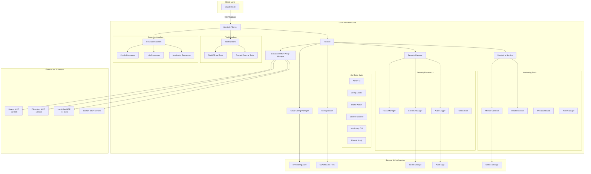

# Omni MCP Hub

A comprehensive, enterprise-grade MCP (Model Context Protocol) server for Claude Code integration with **advanced security**, **monitoring**, and **CLAUDE.md configuration management**. This server provides a complete solution for externalizing Claude's behavior configuration, managing multiple profiles, and integrating with external MCP servers.

## 🚀 Features

### Core Capabilities
- **🛠 Tools**: Built-in tools (add, echo) + comprehensive MCP tool integration
- **📚 Resources**: Dynamic resource exposure through MCP protocol
- **📝 TypeScript**: Full TypeScript support with comprehensive type safety
- **🔌 Official SDK**: Built using the official `@modelcontextprotocol/sdk`
- **⚡ Ready-to-use**: Works out of the box with Claude Code
- **🎯 CLAUDE.md Management**: Load, manage, and apply external Claude configurations
- **🔄 Dynamic Behavior**: Switch between different Claude personalities/behaviors seamlessly
- **👥 Profile Management**: Support for multiple configuration profiles with inheritance
- **💾 Persistent Storage**: Save and update CLAUDE.md files with integrity checking
- **📄 YAML Configuration**: Advanced file scanning and configuration via `omni-config.yaml`
- **🚀 Auto-loading**: Automatically load profiles on startup via configuration
- **🎛️ File Filtering**: Exclude/include files with configurable patterns

### 🔒 Security Features
- **🛡️ Secrets Scanner**: Advanced secrets detection with 40+ pattern types
- **🔐 RBAC System**: Role-based access control with fine-grained permissions
- **📋 Audit Logging**: Comprehensive audit trail for all operations
- **🚨 Rate Limiting**: Configurable rate limiting with multiple strategies
- **🔍 Input Sanitization**: SQL injection and XSS protection
- **🏰 Execution Sandbox**: Secure command execution environment
- **🔑 Secret Management**: Multi-provider secret storage (Vault, Keychain, Environment)
- **✅ Signature Verification**: Cryptographic verification of configurations
- **🛡️ Path Security**: Directory traversal protection and path validation

### 📊 Monitoring & Observability
- **📈 Metrics Collection**: Real-time metrics with Prometheus compatibility
- **🏥 Health Checking**: Comprehensive health monitoring for all components
- **📊 Dashboard**: Web-based monitoring dashboard with real-time updates
- **⚠️ Audit System**: Complete audit trail with structured logging
- **📉 Performance Monitoring**: Request/response timing and resource usage
- **🔄 Health Endpoints**: REST endpoints for external monitoring systems

### 🖥️ CLI Tools Suite
- **🎛️ Admin UI**: Interactive administration interface
- **⚙️ Config Doctor**: Configuration validation and troubleshooting
- **👤 Profile Admin**: Profile management and integrity checking
- **🔍 Secrets Scanner**: Standalone secrets scanning with multiple output formats
- **📊 Monitoring CLI**: System monitoring and metrics access
- **📋 Manual Apply**: Manual configuration application with disclosure mode

### 🏗️ Advanced Architecture
- **🔄 MCP Proxy**: Enhanced proxy manager with resilience features
- **📝 Behavior System**: Advanced behavior generation and profile inheritance
- **✅ Validation**: Schema validation with fail-fast error handling
- **🔄 Auto-Recovery**: Automatic recovery from external server failures
- **📊 Load Balancing**: Distribution across multiple external MCP servers
- **🎯 Smart Routing**: Intelligent routing based on tool capabilities

## 🚀 Quick Start

### 🎯 One-Line Setup

```bash
# Clone and start with minimal configuration
git clone https://github.com/reivosar/omni-mcp-hub.git
cd omni-mcp-hub && npm install && npm run build
echo 'profiles: [{name: "default", path: "./examples/local-resources/dev-assistant.md"}]' > omni-config.yaml
npm start
```

### 🐳 Docker Setup (Recommended)

```bash
# Production deployment
docker-compose -f docker/docker-compose.yml up -d

# Development with hot reload
docker-compose -f docker/docker-compose.yml --profile dev up

# With external databases and full monitoring
docker-compose -f docker/docker-compose.yml --profile postgres --profile redis --profile monitoring up -d

# Testing with MCP servers
docker-compose -f docker/docker-compose.yml --profile test up
```

### 🛠️ Native Setup

**Quick Start Options:**

```bash
# Mixed MCP servers with multiple integrations (Recommended)
./examples/mixed/start.sh

# Local CLAUDE.md resources and character behaviors
./examples/local-resources/start.sh

# External MCP server integration (Docker)
./examples/docker/mcp/start.sh
```

Each script automatically:
1. 🏗️ Builds the project
2. ⚙️ Configures Claude Code MCP settings
3. 🚀 Starts Claude Code with the appropriate configuration
4. 🔍 Runs initial health checks

## 🛠️ Available Tools

### Core MCP Tools
- **add**: Add two numbers together (demo tool)
- **echo**: Echo back a message (demo tool)

### 📝 CLAUDE.md Management Tools (when fileSettings configured)
- **apply_claude_config**: Load and apply CLAUDE.md configuration files
- **list_claude_configs**: List all available configuration files (loaded + scannable)
- **get_applied_config**: Get detailed information about currently applied configuration

### 🌐 External MCP Server Tools (when configured)
- **🧠 Serena Tools** (~25 tools): Semantic code search, symbol manipulation, memory management
- **📂 Filesystem Tools** (~14 tools): File system browsing and operations with security
- **📄 Local-files Tools** (~14 tools): Local markdown and text file reading
- **🔄 Git Tools** (when available): Git repository operations and commit history

### 🖥️ CLI Tools
```bash
# Interactive administration interface
npm run admin

# Configuration validation and troubleshooting
npm run config:doctor

# Profile management
npm run profile:admin

# Secrets scanning
npm run scan:secrets

# System monitoring
npm run monitoring

# Manual configuration application
npm run manual:apply
```

## 📚 Available Resources

- **info://server**: Server information and status
- **greeting://world**: Demo greeting message
- **config://auto-apply**: Auto-apply instructions for profiles with `autoApply: true`
- **config://files/scannable**: All scannable configuration files
- **config://profiles/active**: Currently loaded/active profile information
- **config://applied**: Currently applied configuration details
- **monitoring://health**: System health status
- **monitoring://metrics**: Real-time system metrics

## ⚙️ Configuration

### 🎯 Quick Start Configuration (< 10 lines)

The simplest configuration to get started:

```yaml
# omni-config.yaml
autoLoad:
  profiles:
    - name: "default"
      path: "./examples/local-resources/dev-assistant.md"
      autoApply: true

externalServers:
  enabled: true
  servers:
    - name: "filesystem"
      command: "npx"
      args: ["-y", "@modelcontextprotocol/server-filesystem", "."]
```

That's it! You're ready to use Claude Code with full MCP integration.

### 📊 Configuration Levels

Choose the configuration that fits your needs:

| Level | Lines | Features | Use Case | Location |
|-------|-------|----------|----------|----------|
| **Minimal** | < 10 | Basic profiles + 1 external server | Getting started, prototypes | `examples/minimal/` |
| **Standard** | ~30 | Multiple profiles + essential servers | Development teams | `examples/standard/` |
| **Advanced** | ~50 | Security + monitoring + multiple servers | Power users | `examples/mixed/` |
| **Enterprise** | 100+ | Full security + RBAC + audit + monitoring | Production deployments | `examples/enterprise/` |

### 🚀 Getting Started

1. **Start with example config**:
   ```bash
   cp examples/minimal/omni-config.yaml .      # Simplest
   cp examples/standard/omni-config.yaml .     # Recommended
   cp examples/mixed/omni-config.yaml .        # Advanced
   cp examples/enterprise/omni-config.yaml .   # Full features
   ```

2. **Apply profiles in Claude Code**:
   ```
   /use apply_claude_config profileName:"default"
   /use list_claude_configs
   /use get_applied_config
   ```

3. **Use CLI tools**:
   ```bash
   npm run admin              # Interactive admin UI
   npm run config:doctor      # Validate configuration
   npm run monitoring         # System monitoring
   ```

### 📖 Documentation

- **📋 Configuration Guide**: [docs/CONFIGURATION.md](./docs/CONFIGURATION.md)
- **🏗️ Architecture Guide**: [docs/ARCHITECTURE.md](./docs/ARCHITECTURE.md)  
- **👤 Admin UI Guide**: [docs/ADMIN_UI.md](./docs/ADMIN_UI.md)
- **🛡️ Security**: [docs/THREAT_MODEL.md](./docs/THREAT_MODEL.md)
- **📊 Schema**: [schemas/omni-config.schema.json](./schemas/omni-config.schema.json)
- **🎯 Examples**: [examples/](./examples/) directory with working configurations

## 🏗️ Development

### 📁 Project Structure

```
src/
├── index.ts                     # 🎯 Main server orchestrator (slim, focused)
├── behavior/                    # 🧠 Behavior management system
│   ├── apply.ts                 # Profile application logic
│   ├── hash.ts                  # Configuration hashing
│   ├── merge-rules.ts           # Profile inheritance and merging
│   └── state.ts                 # State management
├── cli/                         # 🖥️ Command-line interfaces (6 tools)
│   ├── admin-ui.ts              # Interactive admin interface
│   ├── config-doctor.ts         # Configuration validation/troubleshooting
│   ├── manual-apply.ts          # Manual configuration application
│   ├── monitoring-cli.ts        # System monitoring CLI
│   ├── profile-admin.ts         # Profile management
│   └── secrets-scan-cli.ts      # Secrets detection CLI
├── config/                      # ⚙️ Configuration management
│   ├── loader.ts                # Multi-format config loader (.mcp-config.json, YAML)
│   └── yaml-config.ts           # YAML configuration manager
├── mcp-proxy/                   # 🔄 Enhanced MCP proxy system
│   ├── client.ts                # MCP client implementation
│   ├── enhanced-manager.ts      # Advanced proxy management
│   ├── manager.ts               # Core proxy manager
│   ├── resilience-manager.ts    # Resilience and recovery
│   └── resilience.ts            # Resilience strategies
├── monitoring/                  # 📊 Observability and monitoring
│   ├── audit.ts                 # Audit logging system
│   ├── dashboard.ts             # Web monitoring dashboard
│   ├── health-checker.ts        # Health monitoring
│   ├── metrics-collector.ts     # Metrics collection
│   ├── monitoring-server.ts     # Monitoring HTTP server
│   └── monitoring-service.ts    # Monitoring coordination
├── security/                    # 🔒 Security framework
│   ├── audit-logging.ts         # Comprehensive audit trails
│   ├── execution-sandbox.ts     # Secure command execution
│   ├── input-sanitization.ts    # SQL injection/XSS protection
│   ├── permission-validator.ts  # Permission validation
│   ├── providers/               # Secret storage providers
│   │   ├── env-provider.ts      # Environment variables
│   │   ├── keychain-provider.ts # macOS Keychain
│   │   └── vault-provider.ts    # HashiCorp Vault
│   ├── rate-limiter.ts          # Rate limiting with multiple strategies
│   ├── rbac-manager.ts          # Role-based access control
│   ├── secret-manager.ts        # Secret storage coordination
│   ├── secrets-scanner.ts       # 40+ secret pattern detection
│   ├── secure-communication.ts  # Encrypted communication
│   └── signature-verification.ts # Cryptographic verification
├── tools/                       # 🛠️ MCP tool handlers
│   └── handlers.ts              # Tool implementations (apply_claude_config, etc.)
├── resources/                   # 📚 MCP resource handlers
│   └── handlers.ts              # Resource implementations (server info, profiles)
├── utils/                       # 🔧 Shared utilities
│   ├── behavior-generator.ts    # Claude behavior instruction generator
│   ├── claude-config.ts         # CLAUDE.md parser and manager
│   ├── error-handler.ts         # Centralized error handling
│   ├── file-scanner.ts          # Directory scanning with pattern matching
│   ├── github-client.ts         # GitHub API integration
│   ├── logger.ts                # Structured logging
│   ├── path-resolver.ts         # Secure path resolution
│   ├── path-security.ts         # Path traversal protection
│   ├── profile-inheritance.ts   # Profile inheritance logic
│   ├── profile-manager.ts       # Profile lifecycle management
│   └── schema-version-manager.ts # Schema version management
└── validation/                  # ✅ Validation system
    ├── fail-fast.ts             # Fail-fast validation
    └── schema-validator.ts      # JSON schema validation
```

### 🏛️ Architecture

The codebase follows an **enterprise-grade modular architecture** with clear separation of concerns:

- **🎯 `index.ts`**: Slim orchestrator that coordinates all components
- **⚙️ `config/`**: Multi-format configuration loading and management
- **🛠️ `tools/`**: MCP tool implementations for Claude Code integration  
- **📚 `resources/`**: MCP resource implementations for data exposure
- **🔒 `security/`**: Comprehensive security framework with RBAC, audit logging, secrets scanning
- **📊 `monitoring/`**: Full observability stack with metrics, health checks, dashboard
- **🖥️ `cli/`**: Rich CLI tools for administration, monitoring, configuration management
- **🧠 `behavior/`**: Advanced behavior management with profile inheritance
- **🔄 `mcp-proxy/`**: Enhanced MCP proxy with resilience and load balancing
- **✅ `validation/`**: Schema validation with fail-fast error handling
- **🔧 `utils/`**: Shared utilities for configuration parsing, security, and behavior generation

Each module is **independently testable**, **highly cohesive**, and has a **single responsibility**.

### 🔧 Adding New Components

#### Adding New Tools
1. Add tool definition to `src/tools/handlers.ts` in the tools array
2. Add case handler in `setupCallToolHandler()` method
3. Implement tool method with proper TypeScript types
4. Add comprehensive tests in `tests/tools/` directory
5. Update schema in `schemas/` if needed
6. Rebuild: `npm run build`

#### Adding New CLI Tools
1. Create new CLI in `src/cli/your-tool.ts`
2. Add to `package.json` bin section
3. Add npm script in `package.json`
4. Add tests in `tests/cli/`
5. Document in README and help text

#### Adding New Security Features
1. Implement in appropriate `src/security/` module
2. Add to security configuration schema
3. Add comprehensive tests including security boundary tests
4. Update threat model documentation

#### Adding New Monitoring Features
1. Extend `src/monitoring/` components
2. Add metrics to collector
3. Update dashboard if UI changes needed
4. Add monitoring tests

## 🧪 Testing

**Test Coverage: 99.94% (1,200+ tests passing)**

Run tests with comprehensive coverage:

```bash
# Install dependencies
npm install

# Run all tests with coverage
npm test

# Run tests in watch mode
npm run test:watch

# Run tests with interactive UI
npm run test:ui

# Generate coverage report
npm run test:coverage

# Monitor test processes
npm run test:monitor

# Force cleanup test processes (if needed)
npm run test:force-stop
```

### 🏗️ Test Structure

```
tests/
├── behavior/                    # 🧠 Behavior system tests
├── cli/                        # 🖥️ CLI tool tests (comprehensive coverage)
├── config/                     # ⚙️ Configuration tests
├── e2e/                       # 🔄 End-to-end integration tests
├── integration/               # 🔗 System integration tests
├── mcp-proxy/                 # 🔄 MCP proxy tests (stability, resilience)
├── monitoring/                # 📊 Monitoring system tests
├── performance/               # ⚡ Performance and load tests
├── security/                  # 🔒 Security boundary tests
├── tools/                     # 🛠️ MCP tool handler tests
├── utils/                     # 🔧 Utility function tests
└── validation/                # ✅ Validation system tests
```

### 🎯 Test Categories

- **Unit Tests**: Individual component testing with mocking
- **Integration Tests**: Multi-component interaction testing
- **Security Tests**: Security boundary and penetration testing
- **Performance Tests**: Load testing and performance validation  
- **End-to-End Tests**: Complete workflow testing
- **CLI Tests**: Interactive CLI testing with process management
- **Fuzz Tests**: Input fuzzing for robustness testing

All tests use **Vitest** with TypeScript support and provide:
- 🎯 Comprehensive mocking and stubbing
- 📊 Detailed coverage reports with branch coverage
- 🔄 Watch mode for development
- 🎨 Interactive UI for test exploration
- 🚀 Parallel execution for speed
- 📈 Performance benchmarking

## 📜 Scripts

### 🏗️ Development Scripts
```bash
npm run build           # Build TypeScript to JavaScript
npm run start          # Run the built server  
npm run dev            # Development mode with tsx and hot reload
npm run lint           # ESLint code analysis
npm run lint:fix       # Auto-fix ESLint issues
npm run format         # Format code with Prettier
```

### 🧪 Testing Scripts
```bash
npm test              # Run all tests with coverage
npm run test:watch    # Watch mode for development
npm run test:ui       # Interactive test UI  
npm run test:coverage # Detailed coverage report
npm run test:cleanup  # Clean up test processes
npm run test:monitor  # Monitor running test processes
```

### 🔒 Security Scripts  
```bash
npm run scan:secrets           # Scan for hardcoded secrets
npm run scan:secrets:pre-commit # Pre-commit secrets scan
npm run scan:secrets:ci        # CI secrets scan with JSON output
```

### 🖥️ CLI Scripts
```bash
npm run admin           # Interactive admin UI
npm run admin:status    # Show system status
npm run profile:admin   # Profile management CLI
npm run config:doctor   # Configuration doctor (interactive)
npm run config:check    # Configuration validation
npm run config:validate # Schema validation
npm run monitoring      # System monitoring CLI
npm run manual:apply    # Manual configuration application
npm run disclosure      # Disclosure mode CLI
```

### 🔄 Development Workflow
```bash
npm run install:hooks   # Install Git hooks
npm run release        # Semantic release
npm run release:dry    # Dry run release
```

## 🏗️ Architecture Overview

### 🎯 System Architecture



### 🔄 Request Flow

```mermaid
flowchart LR
    User[User] -->|Command| Claude[Claude Code]
    Claude -->|MCP Request| Hub[Omni MCP Hub]
    
    Hub --> Auth{Authentication}
    Auth -->|Authenticated| RateLimit{Rate Limit Check}
    RateLimit -->|Allowed| Decision{Tool Type?}
    
    Decision -->|CLAUDE.md Tool| LocalHandler[Local Handler]
    LocalHandler --> Security[Security Check]
    Security --> FileSystem[File System]
    FileSystem -->|Profile Data| LocalHandler
    LocalHandler --> AuditLog[Audit Log]
    AuditLog -->|Response| Hub
    
    Decision -->|External Tool| ProxyManager[Enhanced Proxy Manager]
    ProxyManager --> LoadBalancer[Load Balancer]
    LoadBalancer --> ExtServer[External MCP Server]
    ExtServer -->|Tool Result| Resilience[Resilience Check]
    Resilience -->|Response| ProxyManager
    ProxyManager --> Hub
    
    Decision -->|Admin Tool| CLIHandler[CLI Tool Handler]
    CLIHandler --> AdminFunction[Admin Function]
    AdminFunction -->|Result| Hub
    
    Hub --> Metrics[Update Metrics]
    Metrics -->|MCP Response| Claude
    Claude -->|Result| User
    
    Auth -->|Failed| AuthError[Authentication Error]
    RateLimit -->|Blocked| RateError[Rate Limit Error]
```



## 🎨 CLAUDE.md Format

```markdown
# Project Configuration

Project Name: My AI Assistant  
Description: Custom Claude configuration for development
Version: 2.0.0
Author: Development Team
Tags: development, ai-assistant, claude

# Instructions

Your main system instructions here...
- Be helpful and accurate
- Follow coding best practices
- Provide detailed explanations

# Custom Instructions

- Custom instruction 1: Focus on TypeScript development
- Custom instruction 2: Prioritize security considerations
- Custom instruction 3: Include performance implications

# Rules

- Rule 1: Always validate user input
- Rule 2: Follow the principle of least privilege
- Rule 3: Log important operations for audit

# Knowledge

- Knowledge item 1: This project uses Vitest for testing
- Knowledge item 2: We follow semantic versioning
- Knowledge item 3: Security is paramount - use RBAC

# Context

- Context 1: We're building an enterprise MCP server
- Context 2: High test coverage is mandatory (>95%)
- Context 3: All CLI tools must have --help support

# Tools

- Available tool 1: Secrets scanner for security
- Available tool 2: Admin UI for management  
- Available tool 3: Config doctor for troubleshooting

# Memory

This is a production system requiring:
- High availability and resilience
- Comprehensive security measures
- Detailed audit logging
- Performance monitoring
- Multi-tenant capabilities

# Inheritance

Inherits from: base-security.md, monitoring-base.md

# Behavior

Priority: high
Auto-apply: true
Merge strategy: deep-merge
```

## 📄 License

MIT License - see [LICENSE](./LICENSE) file for details.

## 🤝 Contributing

We welcome contributions! Please see our [Contributing Guide](./CONTRIBUTING.md) and [Code of Conduct](./CODE_OF_CONDUCT.md).

### 🚀 Quick Contribution Setup

```bash
git clone https://github.com/reivosar/omni-mcp-hub.git
cd omni-mcp-hub
npm install
npm run install:hooks    # Install Git hooks
npm run build
npm test                 # Ensure all tests pass
```

## 🆘 Support

- **📚 Documentation**: Check the [docs/](./docs/) directory
- **🐛 Issues**: Report bugs via [GitHub Issues](https://github.com/reivosar/omni-mcp-hub/issues)
- **💬 Discussions**: Join [GitHub Discussions](https://github.com/reivosar/omni-mcp-hub/discussions)
- **🔒 Security**: Report security issues via [security policy](./SECURITY.md)

---

**⭐ Star this repository if you find it useful!**

*Built with ❤️ for the Claude Code community*