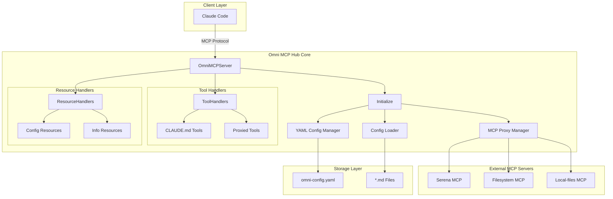
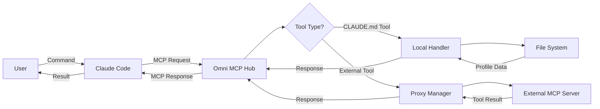

# Omni MCP Hub

A universal MCP (Model Context Protocol) server for Claude Code integration with **CLAUDE.md configuration management**. This server allows you to externalize Claude's behavior configuration and dynamically control how Claude Code behaves using external CLAUDE.md files.

## Features

- **Tools**: Built-in example tools (add, echo) demonstrating MCP tool integration
- **Resources**: Example resources showing how to expose data through MCP
- **TypeScript**: Full TypeScript support with proper types
- **Official SDK**: Built using the official `@modelcontextprotocol/sdk`
- **Ready-to-use**: Works out of the box with Claude Code
- **CLAUDE.md Management**: Load, manage, and apply external Claude configurations
- **Dynamic Behavior**: Switch between different Claude personalities/behaviors
- **Profile Management**: Support for multiple configuration profiles
- **Persistent Storage**: Save and update CLAUDE.md files
- **YAML Configuration**: Advanced file scanning and configuration via `omni-config.yaml`
- **Auto-loading**: Automatically load profiles on startup via configuration
- **File Filtering**: Exclude/include files with configurable patterns

## Quick Start

### Native Setup

**Quick Start Options:**

Choose your configuration and run the appropriate setup script:

```bash
# For mixed MCP servers with multiple integrations (Recommended)
./examples/mixed/start.sh

# For local CLAUDE.md resources and character behaviors
./examples/local-resources/start.sh

# For external MCP server integration (Docker)
./examples/docker/mcp/start.sh
```

### Docker Setup

**Run with Docker (Recommended):**

```bash
# Production deployment
docker-compose -f docker/docker-compose.yml up -d

# Development with hot reload
docker-compose -f docker/docker-compose.yml --profile dev up

# With external databases
docker-compose -f docker/docker-compose.yml --profile postgres --profile redis up -d

# Testing with MCP servers
docker-compose -f docker/docker-compose.yml --profile test up
```

**Quick Docker Commands:**
```bash
# Build and run
docker build -t omni-mcp-hub -f docker/Dockerfile .
docker run -p 3000:3000 -v $(pwd)/omni-config.yaml:/app/omni-config.yaml omni-mcp-hub

# Development mode
docker-compose -f docker/docker-compose.yml up omni-mcp-hub-dev
```

Each script automatically:
1. Builds the project
2. Configures Claude Code MCP settings
3. Starts Claude Code with the appropriate configuration

**Using Claude Code:**
1. The script automatically starts `claude`
2. Execute test commands:
   ```
   /use apply_claude_config profileName:"lum"
   /use list_claude_configs
   /use get_applied_config
   ```

## Available Tools

### Basic Tools
- **add**: Add two numbers together
- **echo**: Echo back a message

### CLAUDE.md Management Tools (enabled when fileSettings are configured)
- **apply_claude_config**: Load and apply a CLAUDE.md configuration file
- **list_claude_configs**: List all CLAUDE.md configuration files (both loaded and available)
- **get_applied_config**: Get information about the currently applied configuration

### External MCP Server Tools (when configured)
- **Serena Tools** (~25 tools): Semantic code search, symbol manipulation, memory management
- **Filesystem Tools** (~14 tools): File system browsing and operations
- **Local-files Tools** (~14 tools): Local markdown and text file reading
- **Git Tools** (when available): Git repository operations and history

## Available Resources

- **info://server**: Server information
- **greeting://world**: A greeting message
- **config://auto-apply**: Auto-apply instructions (when profiles have autoApply: true)
- **config://files/scannable**: Scannable configuration files
- **config://profiles/active**: Active configuration profiles

### CLAUDE.md Format

```markdown
# Project Name

Project Name: My AI Assistant
Description: Custom Claude configuration
Version: 1.0.0

# Instructions

Your main system instructions here...

# Custom Instructions

- Custom instruction 1
- Custom instruction 2

# Rules

- Rule 1
- Rule 2

# Knowledge

- Knowledge item 1
- Knowledge item 2

# Context

- Context information 1
- Context information 2

# Tools

- Available tool 1
- Available tool 2

# Memory

Memory context and information to remember...
```

## YAML Configuration

The server supports configuration via `omni-config.yaml` in your working directory. Choose from 4 standardized examples:

- **Minimal**: Single profile, basic logging (5 lines)
- **Standard**: Multiple profiles, essential external servers (~15 lines)
- **Enterprise**: Full security, advanced monitoring, multiple servers
- **Docker**: Container-friendly configuration with health endpoints

### Example Configuration

```yaml
# Profile Management (Simplified)
profiles:
  - name: "default"
    path: "CLAUDE.md"
  - name: "assistant"
    path: "./examples/assistant-behavior.md"

# External MCP Servers (Optional)
externalServers:
  - name: "filesystem"
    command: "npx"
    args: ["-y", "@modelcontextprotocol/server-filesystem", "."]
    description: "File system operations"

# Basic Settings
logging:
  level: "info"
```

**See the `examples/` directory for 4 standardized configuration templates and migration guide.**

### Configuration Usage

**Getting Started:**

1. **Choose a configuration**: Copy from `examples/` directory
   ```bash
   cp examples/minimal/omni-config.yaml .  # Recommended for beginners
   cp examples/standard/omni-config.yaml . # Recommended for teams
   ```

2. **Create your profile**: Add a `CLAUDE.md` file with your instructions

3. **Apply profiles in Claude Code**:
   ```
   /use apply_claude_config default
   /use list_claude_configs
   /use get_applied_config
   ```

**Note**: MCP tools cannot automatically modify Claude's behavior - you must manually apply profiles using the commands above. This is a fundamental limitation of the MCP protocol.

## Development

### Project Structure

```
src/
├── index.ts                    # Main server class (slim orchestrator)
├── config/
│   ├── loader.ts              # Configuration loader (.mcp-config.json, YAML)
│   └── yaml-config.ts         # YAML configuration manager
├── tools/
│   └── handlers.ts            # MCP tool handlers (apply_claude_config, etc.)
├── resources/
│   └── handlers.ts            # MCP resource handlers (server info, profiles)
└── utils/
    ├── claude-config.ts       # CLAUDE.md file parser and manager
    ├── behavior-generator.ts  # Claude behavior instruction generator
    └── file-scanner.ts        # Directory scanning with pattern matching
```

### Architecture

The codebase follows a **modular architecture** with clear separation of concerns:

- **`index.ts`**: Slim orchestrator that initializes and coordinates all components
- **`config/`**: Configuration loading and management
- **`tools/`**: MCP tool implementations for Claude Code integration  
- **`resources/`**: MCP resource implementations for data exposure
- **`utils/`**: Shared utilities for configuration parsing and behavior generation

Each module is **independently testable** and has a **single responsibility**.

### Adding New Tools

1. Add tool definition to `src/tools/handlers.ts` in the tools array
2. Add case handler in `setupCallToolHandler()` method
3. Add tool implementation method
3. Create tests in `tests/` directory
4. Rebuild: `npm run build`

### Adding New Resources

1. Add resource definition to `src/resources/handlers.ts` in `setupListResourcesHandler()`
2. Add resource implementation to `src/resources/handlers.ts` in `setupReadResourceHandler()`
3. Create tests in `tests/` directory
4. Rebuild: `npm run build`

### Adding New Configuration Sources

1. Extend `src/config/loader.ts` to support new configuration formats
2. Update `src/utils/claude-config.ts` if new parsing logic is needed
3. Add corresponding tests in `tests/config-loader.test.ts`

## Testing

Run tests with Vitest:

```bash
# Install dependencies (if not already installed)
npm install

# Run all tests
npm test

# Run tests once (without watch mode)
npm test -- --run

# Run tests with coverage
npm run test:coverage

# Run tests with UI
npm run test:ui
```

### Test Structure

- `tests/claude-config.test.ts` - Unit tests for ClaudeConfigManager
- `tests/behavior-generator.test.ts` - Unit tests for BehaviorGenerator  
- `tests/config-loader.test.ts` - Unit tests for ConfigLoader
- `tests/config-loader-extended.test.ts` - Extended tests for YAML integration
- `tests/yaml-config.test.ts` - Unit tests for YamlConfigManager
- `tests/file-scanner.test.ts` - Unit tests for FileScanner
- `tests/tools-handlers.test.ts` - Unit tests for MCP tool handlers
- `tests/resources-handlers.test.ts` - Unit tests for MCP resource handlers
- `tests/index.test.ts` - Unit tests for OmniMCPServer main class
- `tests/integration.test.ts` - Integration tests for the complete system

All tests are written using **Vitest** with TypeScript support and provide comprehensive coverage of:
- CLAUDE.md file parsing and saving
- Configuration profile management
- YAML configuration loading and validation
- File scanning with pattern matching
- MCP tool handlers (`apply_claude_config`, `list_claude_configs`, `get_applied_config`)
- MCP resource handlers
- Integration between all components

**Test Coverage**: 81.05% (928/928 tests passing - 100% success rate)

## Scripts

### Native Development
- `npm run build` - Build TypeScript to JavaScript
- `npm run start` - Run the built server
- `npm run dev` - Run in development mode with tsx
- `npm test` - Run tests with Vitest
- `npm run test:ui` - Run tests with Vitest UI
- `npm run test:coverage` - Run tests with coverage report

## Architecture

### System Overview



### Tool Request Flow



## License

MIT