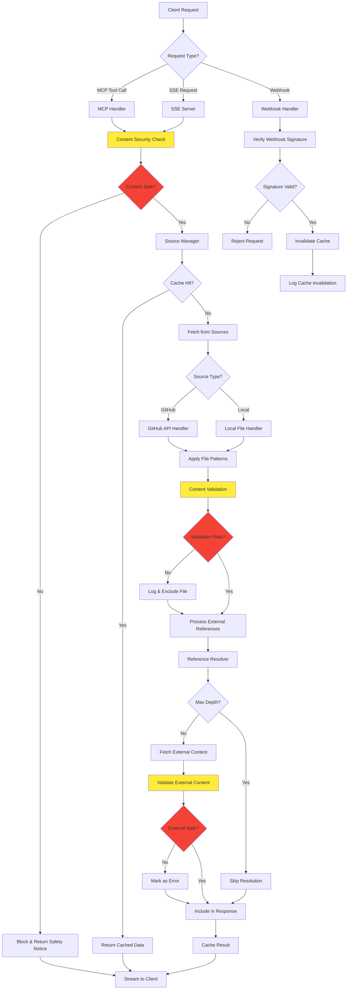

# Omni MCP Hub

A Model Context Protocol (MCP) server that aggregates documentation from multiple GitHub repositories and local directories, providing a unified interface for AI assistants like Claude.

## Features

- **Multi-source aggregation**: Combine documentation from multiple GitHub repos, local directories, and MCP servers
- **MCP server integration**: Native support for filesystem, SQLite, and custom MCP servers
- **Docker deployment**: Production-ready Docker configurations with multiple deployment patterns
- **Multi-tier configuration**: Support for hierarchical configuration with external reference resolution
- **Smart caching**: Automatic cache invalidation via GitHub webhooks with Docker environment optimization
- **External reference resolution**: Automatically fetches linked documentation with depth control
- **Security-first design**: Sandboxed execution, CORS protection, webhook signature verification
- **SSE streaming**: Real-time document streaming for better performance
- **MCP compatible**: Works with Claude Code and other MCP-compatible AI assistants
- **Production hardening**: Security policies, monitoring, and enterprise-scale deployment support

## Quick Start

### 1. Installation

```bash
git clone https://github.com/your-org/omni-mcp-hub.git
cd omni-mcp-hub
npm install
```

### Docker Deployment (Recommended)

For production deployments and Claude Code integration:

```bash
cd examples/docker
./start.sh
```

Available configurations:
- `github_sources` - GitHub repository access
- `local_sources` - Local filesystem access  
- `mcp_servers` - MCP server integration
- `mixed_resources` - Combined resource types

The start script provides:
- Interactive configuration selection
- Claude Code automatic registration
- Docker container orchestration
- Environment-specific optimizations

### 2. Configuration

The server can run with either a configuration file or environment variables:

**Option 1: Configuration file (recommended for complex setups)**
```bash
# Create your configuration from the example
cp mcp-sources.yaml.example mcp-sources.yaml

# Edit mcp-sources.yaml with your sources
# See mcp-sources.yaml.example for detailed options
```

**Option 2: Environment variables only (simple setups)**
```bash
# Define sources directly via environment variable
export SOURCES="github:microsoft/vscode,local:/path/to/project"
```

The server will automatically use environment variables if no configuration file is found.

### 3. Environment Setup

```bash
# Server configuration
export PORT=3000                      # Server port (default: 3000)
export MCP_PORT=3000                  # Alternative port variable

# Required: Webhook secret for GitHub
export GITHUB_WEBHOOK_SECRET=your_webhook_secret_here

# Required: CORS allowed origins (comma-separated)
export ALLOWED_ORIGINS=http://localhost:3000,http://localhost:8080

# GitHub tokens (one per source as needed)
export GITHUB_TOKEN_PUBLIC=ghp_xxxxxxxxxxxxxxxxxxxx
export GITHUB_TOKEN_PRIVATE=ghp_yyyyyyyyyyyyyyyyyyyy

# Optional: Sources directly via environment (for simple setups)
export SOURCES="github:microsoft/vscode,local:/path/to/project"

# Optional: File configuration
export FILE_PATTERNS="CLAUDE.md,*.claude.md,docs/CLAUDE.md"
export MAX_FILE_SIZE=1048576          # 1MB file size limit

# Optional: Fetch settings
export FETCH_TIMEOUT=30000            # 30 seconds
export FETCH_RETRIES=3                # Number of retries
export FETCH_RETRY_DELAY=1000         # 1 second between retries
export FETCH_MAX_DEPTH=3              # Max external reference depth


# Optional: Content security
export CONTENT_VALIDATION_ENABLED=true
export CONTENT_REJECT_PATTERNS="custom\\s+pattern,another\\s+pattern"
export CONTENT_REJECT_KEYWORDS="forbidden1,forbidden2"
```

### 4. Run the Server

```bash
# Development mode with auto-reload
npm run dev

# Production mode
npm start

# Run tests
npm test
```

## API Endpoints

### GET /healthz
Health check endpoint
```bash
curl http://localhost:${PORT:-3000}/healthz
# Response: {"status":"ok"}
```

### POST /sse
MCP-compatible SSE endpoint for fetching documentation
```bash
curl -X POST http://localhost:${PORT:-3000}/sse \
  -H "Content-Type: application/json" \
  -d '{
    "jsonrpc": "2.0",
    "id": 1,
    "method": "fetch_owner_repo_documentation",
    "params": {
      "owner": "microsoft",
      "repo": "vscode",
      "branch": "main",
      "include_externals": true
    }
  }'
```

### POST /webhook
GitHub webhook endpoint for cache invalidation
```bash
# Configure in GitHub repository settings
# Webhook URL: https://your-domain.com:${PORT:-3000}/webhook
# Content type: application/json
# Secret: $GITHUB_WEBHOOK_SECRET
# Events: Push, Pull Request, Repository
```

## Configuration Options

### Multi-Source Configuration
```yaml
# GitHub repositories
github_sources:
  - url: github:owner/repo
  - url: github:owner/repo@branch

# Local directories  
local_sources:
  - url: /absolute/path
  - url: ./relative/path

# MCP servers
mcp_servers:
  - name: filesystem
    type: stdio
    command: npx
    args: ["-y", "@modelcontextprotocol/server-filesystem", "/data"]
    enabled: true
    
  - name: sqlite
    type: stdio
    command: npx
    args: ["-y", "@modelcontextprotocol/server-sqlite", "/app/data.db"]
    enabled: true
```

### External References (Multi-tier)
```yaml
external_references:
  - url: "./base/common.md"
    description: "Common configuration"
  - url: "github:org/config/production.yaml" 
    condition: "${ENVIRONMENT} == 'production'"
  - url: "https://config.company.com/mcp.json"
    cache_ttl: 3600
```

### File Patterns
```yaml
files:
  patterns:
    - "CLAUDE.md"      # Main documentation
    - "*.claude.md"    # Alternative pattern
    - "docs/CLAUDE.md" # Nested docs
  max_size: 1048576    # 1MB limit
```

### Performance Tuning
```yaml
fetch:
  timeout: 30000       # 30 seconds
  retries: 3           # Retry failed requests
  retry_delay: 1000    # 1 second initial delay
  max_depth: 3         # Reference resolution depth

```

## Processing Flow


```mermaid
graph TD
    A[Client Request] --> B{Request Type?}
    
    B -->|MCP Tool Call| C[MCP Handler]
    B -->|SSE Request| D[SSE Server]
    B -->|Webhook| E[Webhook Handler]
    
    C --> F[Content Security Check]
    D --> F
    
    F --> G{Content Safe?}
    G -->|No| H[Block & Return Safety Notice]
    G -->|Yes| I[Source Manager]
    
    I --> J{Cache Hit?}
    J -->|Yes| K[Return Cached Data]
    J -->|No| L[Fetch from Sources]
    
    L --> M{Source Type?}
    M -->|GitHub| N[GitHub API Handler]
    M -->|Local| O[Local File Handler]
    
    N --> P[Apply File Patterns]
    O --> P
    
    P --> Q[Content Validation]
    Q --> R{Validation Pass?}
    R -->|No| S[Log & Exclude File]
    R -->|Yes| T[Process External References]
    
    T --> U[Reference Resolver]
    U --> V{Max Depth?}
    V -->|No| W[Fetch External Content]
    V -->|Yes| X[Skip Resolution]
    
    W --> Y[Validate External Content]
    Y --> Z{External Safe?}
    Z -->|No| AA[Mark as Error]
    Z -->|Yes| BB[Include in Response]
    
    X --> BB
    AA --> BB
    BB --> CC[Cache Result]
    CC --> DD[Stream to Client]
    
    E --> EE[Verify Webhook Signature]
    EE --> FF{Signature Valid?}
    FF -->|No| GG[Reject Request]
    FF -->|Yes| HH[Invalidate Cache]
    HH --> II[Log Cache Invalidation]
    
    S --> T
    K --> DD
    H --> DD
    
    style F fill:#ffeb3b
    style G fill:#f44336
    style Q fill:#ffeb3b
    style R fill:#f44336
    style Y fill:#ffeb3b
    style Z fill:#f44336
```

## Security

### Content Security Validation
- **Multi-layer protection**: Pattern-based detection for prompt injection, system manipulation, and code injection
- **Language-neutral approach**: Technical patterns only, no linguistic bias
- **Conservative thresholds**: Minimizes false positives while maintaining security
- **Configurable rules**: Custom patterns and keywords via YAML configuration
- **Real-time filtering**: Content blocked at multiple processing stages

### Security Configuration
```yaml
security:
  content_validation:
    enabled: true  # Enable/disable content validation
    reject_patterns:
      - "custom\\s+dangerous\\s+pattern"
    additional_keywords:
      - "forbidden_word"
```

### CORS Protection
- Configurable allowed origins via `ALLOWED_ORIGINS` environment variable
- No wildcard origins allowed for security
- Credentials supported for authenticated requests

### Webhook Verification
- HMAC-SHA256 signature verification for all GitHub webhooks
- Timing-safe comparison to prevent timing attacks
- Proper error handling for malformed payloads

### Token Management
- Per-source GitHub tokens for fine-grained access control
- All tokens stored in environment variables, never in config files
- Support for both public and private repositories

## MCP Tools

When integrated with Claude Code or other MCP clients, the following tools are available:

### Native Tools
1. **list_sources**: List all configured sources
2. **get_file**: Fetch a specific file from a source
3. **get_file_variants**: Find all versions of a file across sources
4. **fetch_documentation**: Batch fetch all documentation

### MCP Server Tools (via integration)
- **filesystem__read_file**: Read files from filesystem MCP server
- **filesystem__write_file**: Write files via filesystem MCP server
- **filesystem__list_directory**: List directory contents
- **filesystem__search_files**: Search for files
- **sqlite__execute_query**: Execute SQL queries on SQLite MCP server
- **sqlite__list_tables**: List database tables

All MCP server tools are automatically prefixed with server name for namespace isolation.

## Development

### Project Structure
```
omni-mcp-hub/
├── src/                      # Source code
│   ├── types/                # Type definitions
│   ├── config/               # Configuration management
│   ├── cache/                # Caching layer
│   ├── github/               # GitHub API client
│   ├── handlers/             # Request handlers
│   ├── sources/              # Source management
│   ├── utils/                # Utility functions
│   ├── security/             # Security and sandboxing
│   ├── mcp/                  # MCP server management
│   └── servers/              # Server implementations
├── tests/                    # Test suites
│   ├── unit/                 # Unit tests
│   ├── e2e/                  # End-to-end tests
│   └── strict/               # Strict security tests
├── examples/                 # Example configurations
│   └── docker/               # Docker deployment examples
│       ├── github_sources/   # GitHub-only configuration
│       ├── local_sources/    # Local filesystem configuration
│       ├── mcp_servers/      # MCP server configuration
│       ├── mixed_resources/  # Combined configuration
│       └── docs/             # Multi-tier documentation
│           ├── single/       # Single-tier examples
│           └── multi/        # Multi-tier with external refs
├── mcp-sources.yaml          # Your configuration
└── package.json
```

### Running Tests
```bash
# All tests
npm test

# Specific test suite
npm test tests/unit/cache.test.ts

# With coverage
npm run test:coverage
```

### Building
```bash
# TypeScript compilation
npm run build

# Watch mode
npm run build:watch
```

## Troubleshooting

### Common Issues

1. **CORS errors**: Check `ALLOWED_ORIGINS` includes your client URL
2. **401 Unauthorized**: Verify GitHub tokens are set correctly
3. **Webhook failures**: Ensure `GITHUB_WEBHOOK_SECRET` matches GitHub config
4. **Cache issues**: Check webhook delivery in GitHub settings

### Debug Mode
```bash
# Enable debug logging
DEBUG=* npm start

# Check recent webhook deliveries
gh api /repos/:owner/:repo/hooks

# Test health endpoint
curl http://localhost:${PORT:-3000}/healthz

# Check environment variables
env | grep -E "(PORT|MCP_|GITHUB_|ALLOWED_|SOURCES|FILE_|FETCH_|CONTENT_)"
```

## Performance

### Benchmarks
- **Cache Hit Response**: < 1ms
- **GitHub API Call**: ~200ms (network dependent)
- **Recursive Resolution**: ~500ms for 5 external refs
- **Memory Usage**: ~50MB for 1000 cached files
- **Concurrent Requests**: 50+ concurrent users supported

### Optimization Features
- **Parallel Processing**: Concurrent file and reference fetching
- **Intelligent Caching**: 5-minute TTL with webhook invalidation
- **Rate Limit Handling**: Automatic backoff and retry
- **Memory Management**: Automatic cleanup of expired cache entries

## License

MIT License - see LICENSE file for details

## Contributing

1. Fork the repository
2. Create a feature branch
3. Run tests: `npm test`
4. Submit a pull request

## Docker Deployment

### Production Deployment
```bash
cd examples/docker
./start.sh mixed_resources

# Available configurations:
# - github_sources: GitHub-only access
# - local_sources: Local filesystem only
# - mcp_servers: MCP server tools
# - mixed_resources: All resource types combined
```

### Configuration Tiers

#### Single-Tier (Simple)
All configuration in one file, ideal for development and simple deployments.

#### Multi-Tier (Enterprise)
Hierarchical configuration with external references, supporting:
- Environment-specific overrides (development, staging, production)
- Team-specific configurations (backend, frontend, devops)
- Reusable templates for common patterns
- External reference resolution from GitHub, HTTP, or local files

### Docker Features
- **Automatic MCP server timeout adjustment** for Docker environments
- **Security sandboxing** with non-root user execution
- **Volume mounting** for local development and data persistence
- **Environment variable templating** for configuration flexibility
- **Health checks** and monitoring endpoints
- **Claude Code integration** with automatic registration

## Support

- Issues: GitHub Issues
- Documentation: See `examples/docker/docs/` directory
- Docker Examples: See `examples/docker/` directory
- Configuration Examples: See `examples/` directory