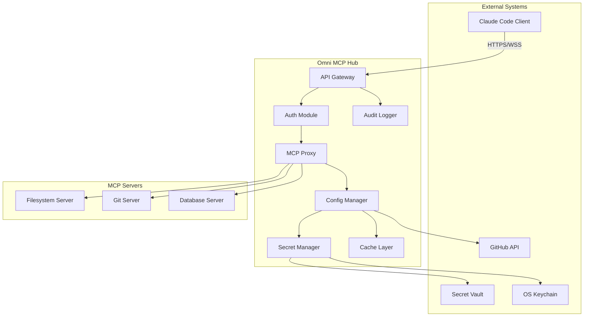
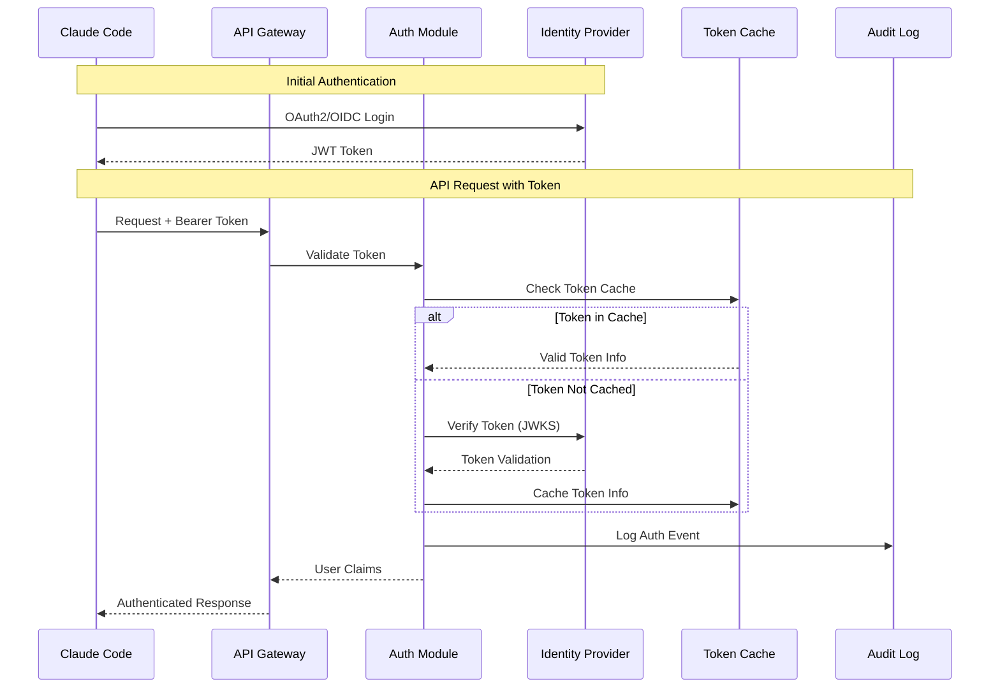
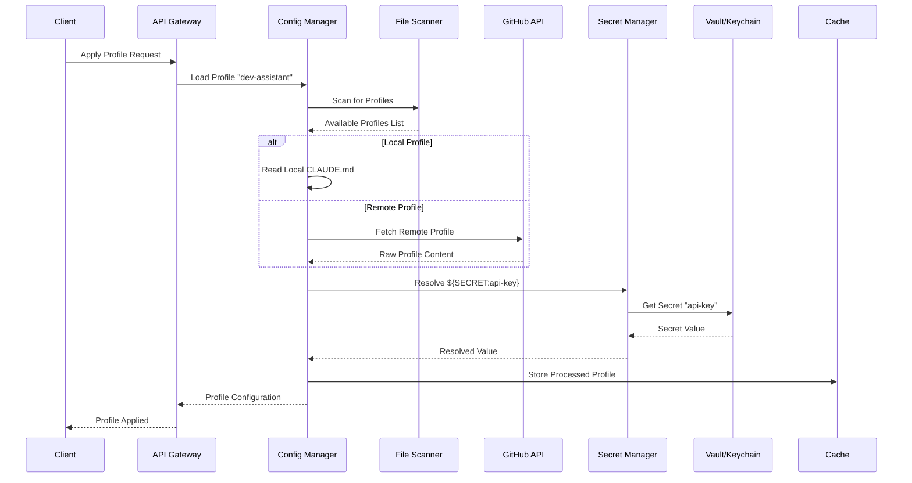
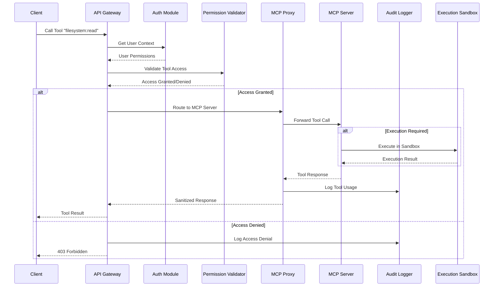
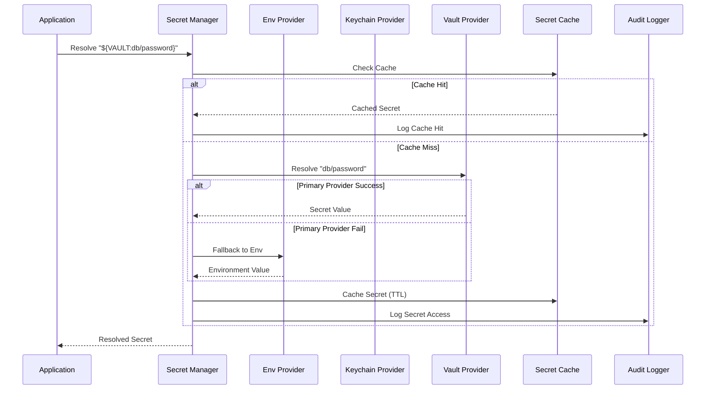
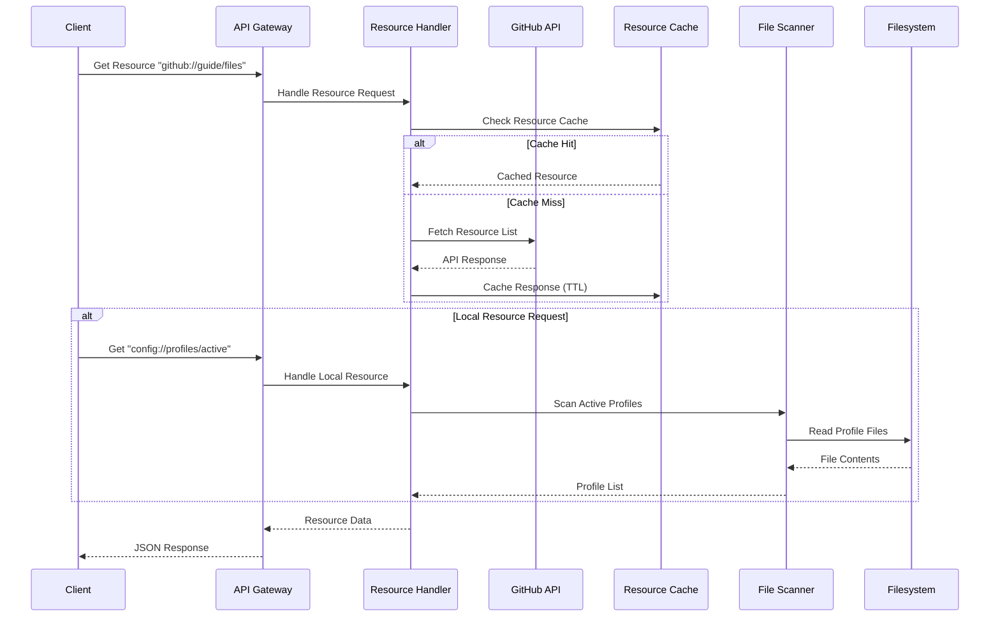
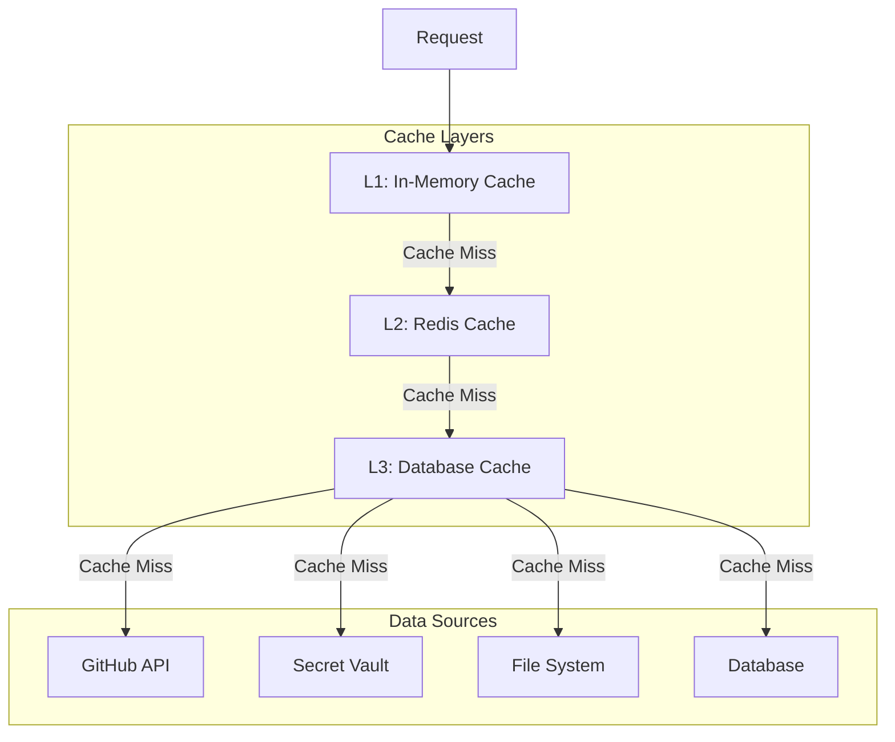
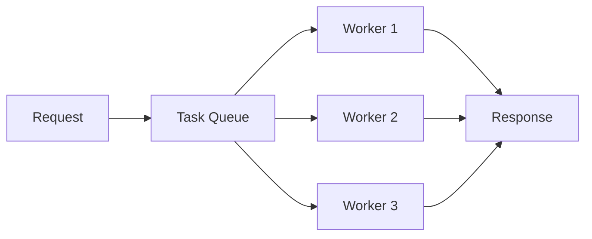
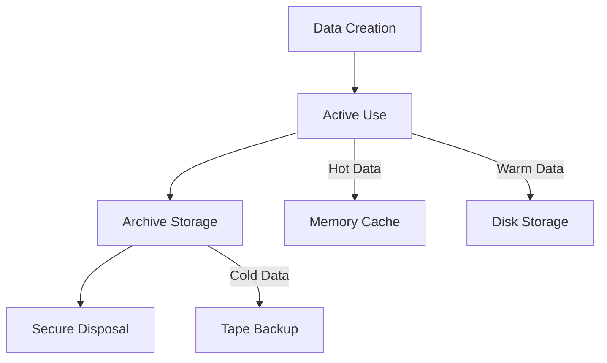

# Data Flow Documentation - Omni MCP Hub

## Overview

This document describes the data flow patterns, transformations, and security boundaries within Omni MCP Hub. Understanding these flows is crucial for security analysis, performance optimization, and troubleshooting.

## High-Level Data Flow



## Detailed Data Flows

### 1. Authentication Flow



**Data Elements:**
- **Input**: JWT token, client credentials
- **Processing**: Token validation, JWKS verification, claims extraction
- **Output**: User identity, permissions, audit event
- **Storage**: Token cache (TTL-based), audit logs

### 2. Configuration Loading Flow



**Data Elements:**
- **Input**: Profile name, file paths, secret references
- **Processing**: File reading, secret resolution, variable substitution
- **Output**: Processed configuration, resolved secrets
- **Storage**: Profile cache, secret cache, audit trail

### 3. MCP Tool Execution Flow



**Data Elements:**
- **Input**: Tool name, parameters, user context
- **Processing**: Permission validation, request routing, response sanitization
- **Output**: Tool results, audit events, error messages
- **Storage**: Execution logs, audit trail, performance metrics

### 4. Secret Management Flow



**Data Elements:**
- **Input**: Secret reference, provider configuration
- **Processing**: Provider selection, fallback handling, caching
- **Output**: Resolved secret value, audit events
- **Storage**: Secret cache (TTL), audit logs, provider metrics

### 5. Resource Access Flow



**Data Elements:**
- **Input**: Resource URI, access permissions
- **Processing**: URI parsing, cache lookup, external API calls
- **Output**: Resource content, metadata, cache entries
- **Storage**: Resource cache (TTL), API rate limit counters

## Security Boundaries and Controls

### 1. Input Validation Boundaries

```
External Input → Validation → Internal Processing
     │              │              │
     ▼              ▼              ▼
┌─────────────┐ ┌─────────────┐ ┌─────────────┐
│ Raw Request │ │   Schema    │ │  Validated  │
│   Data      │ │ Validation  │ │    Data     │
└─────────────┘ └─────────────┘ └─────────────┘
     │              │              │
  Untrusted      Validation      Trusted
    Zone         Boundary        Zone
```

**Validation Controls:**
- JSON Schema validation
- Type checking and coercion
- Range and length validation
- Pattern matching (regex)
- Sanitization of dangerous characters

### 2. Secret Handling Boundaries

```
Secret References → Resolution → In-Memory → Disposal
        │              │           │          │
        ▼              ▼           ▼          ▼
┌─────────────┐ ┌─────────────┐ ┌─────────────┐ ┌─────────────┐
│  Encrypted  │ │ Resolution  │ │ Plain Text  │ │   Memory    │
│  Storage    │ │  Process    │ │  (Temp)     │ │  Cleared    │
└─────────────┘ └─────────────┘ └─────────────┘ └─────────────┘
        │              │           │          │
   Secure Store    Provider      Runtime     Cleanup
                   Boundary     Boundary
```

**Security Controls:**
- Encrypted storage at rest
- Secure transport (TLS)
- Memory clearing after use
- Access logging and audit
- Time-based cache expiration

### 3. Execution Boundaries

```
User Input → Validation → Sandbox → Output Filtering
    │            │          │           │
    ▼            ▼          ▼           ▼
┌─────────┐ ┌─────────┐ ┌─────────┐ ┌─────────┐
│Untrusted│ │Validated│ │Isolated │ │Filtered │
│  Code   │ │  Code   │ │Execution│ │ Output  │
└─────────┘ └─────────┘ └─────────┘ └─────────┘
    │            │          │           │
External      Validation   Sandbox    Response
Boundary      Boundary    Boundary    Boundary
```

**Execution Controls:**
- Code syntax validation
- Resource limits (CPU, memory, time)
- API restriction (file system, network)
- Output sanitization
- Error message filtering

## Performance and Scalability

### 1. Caching Strategy



**Cache Configuration:**
- **L1 Cache**: 5-minute TTL, 1000 entries max
- **L2 Cache**: 1-hour TTL, 10k entries max
- **L3 Cache**: 24-hour TTL, 100k entries max

### 2. Connection Pooling

```
Client Requests
      │
      ▼
┌─────────────┐
│  Connection │
│    Pool     │     ┌─── MCP Server 1
│  (Size: 10) │ ────┼─── MCP Server 2
│             │     └─── MCP Server 3
└─────────────┘
```

**Pool Configuration:**
- Initial size: 5 connections
- Maximum size: 20 connections
- Connection timeout: 30 seconds
- Idle timeout: 5 minutes

### 3. Async Processing



**Processing Patterns:**
- **Synchronous**: Authentication, authorization
- **Asynchronous**: File processing, external API calls
- **Background**: Audit logging, cache warming

## Monitoring and Observability

### 1. Data Flow Metrics

| Metric | Description | Type | Alert Threshold |
|--------|-------------|------|-----------------|
| Request Rate | Requests per second | Counter | > 1000 rps |
| Response Time | Average response time | Histogram | > 500ms |
| Error Rate | Errors per second | Counter | > 10 eps |
| Cache Hit Rate | Cache effectiveness | Gauge | < 70% |
| Connection Pool | Active connections | Gauge | > 80% |

### 2. Security Metrics

| Metric | Description | Type | Alert Threshold |
|--------|-------------|------|-----------------|
| Auth Failures | Failed authentications | Counter | > 100/min |
| Permission Denials | Access denials | Counter | > 50/min |
| Anomalous Requests | Unusual patterns | Counter | > 10/min |
| Secret Access | Secret resolutions | Counter | > 1000/hour |

### 3. Performance Metrics

| Metric | Description | Type | Alert Threshold |
|--------|-------------|------|-----------------|
| Memory Usage | Heap memory usage | Gauge | > 1GB |
| CPU Usage | CPU utilization | Gauge | > 80% |
| Disk I/O | File operations/sec | Counter | > 1000 ops/sec |
| Network I/O | Network bytes/sec | Counter | > 100MB/sec |

## Data Retention and Lifecycle

### 1. Data Categories

| Data Type | Retention Period | Storage Location | Backup Frequency |
|-----------|------------------|------------------|------------------|
| Audit Logs | 7 years | Encrypted storage | Daily |
| Performance Metrics | 90 days | Time-series DB | Hourly |
| Cache Data | 24 hours | Memory/Redis | None |
| Configuration | Indefinite | Version control | On change |
| Secrets | Indefinite | Secure vault | Daily |

### 2. Data Lifecycle Management



### 3. Compliance Requirements

- **GDPR**: Right to erasure, data portability
- **HIPAA**: PHI encryption, access controls
- **SOX**: Audit trail integrity, retention periods
- **PCI DSS**: Cardholder data protection

## Troubleshooting Data Flow Issues

### 1. Common Issues

| Issue | Symptoms | Root Cause | Resolution |
|-------|----------|------------|------------|
| Slow Responses | High latency | Cache misses | Warm cache, optimize queries |
| Auth Failures | 401 errors | Token expiry | Refresh tokens, extend TTL |
| Secret Errors | 500 errors | Provider down | Fallback provider, retry logic |
| Memory Leaks | Increasing memory | Unclosed connections | Connection pooling, GC tuning |

### 2. Diagnostic Tools

- **Request Tracing**: End-to-end request tracking
- **Performance Profiling**: CPU and memory analysis
- **Log Correlation**: Cross-component event matching
- **Health Checks**: Component status monitoring

### 3. Emergency Procedures

1. **Circuit Breaker Activation**: Isolate failing components
2. **Traffic Throttling**: Reduce load during incidents
3. **Fallback Modes**: Degrade gracefully
4. **Data Recovery**: Restore from backups if needed