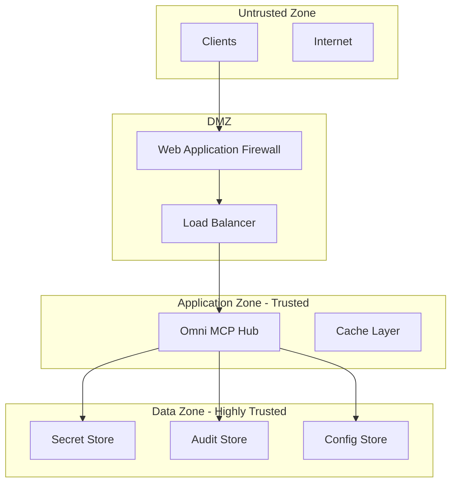

# Threat Model - Omni MCP Hub

## Executive Summary

This threat model identifies security risks, attack vectors, and mitigation strategies for Omni MCP Hub. The analysis follows the STRIDE methodology (Spoofing, Tampering, Repudiation, Information Disclosure, Denial of Service, Elevation of Privilege).

## System Assets

### High-Value Assets
1. **User Credentials & JWT Tokens** - Authentication materials
2. **MCP Server Secrets** - API keys, database passwords, service credentials
3. **User Profiles & Configurations** - CLAUDE.md files, behavior settings
4. **Audit Logs** - Security events, access records, compliance data
5. **System Configuration** - Service topology, security policies

### Medium-Value Assets
1. **Cached Data** - GitHub content, profile cache
2. **Session Data** - Active user sessions, WebSocket connections
3. **Performance Metrics** - System telemetry, usage statistics

## Trust Boundaries

## Threat Analysis by Component

### 1. HTTP/WebSocket API Layer

#### Threats
| ID | Threat | Impact | Likelihood | Risk |
|----|--------|---------|------------|------|
| T001 | **Spoofing**: Fake client impersonation | High | Medium | High |
| T002 | **Tampering**: Request/Response modification | High | Low | Medium |
| T003 | **DoS**: Request flooding, connection exhaustion | Medium | High | High |
| T004 | **Information Disclosure**: API enumeration, error leakage | Medium | Medium | Medium |

#### Mitigations
- **T001**: JWT token validation, client certificate authentication
- **T002**: TLS encryption, request signing, HMAC verification
- **T003**: Rate limiting, connection limits, DDoS protection
- **T004**: Generic error messages, API versioning, input validation

### 2. Authentication & Authorization

#### Threats
| ID | Threat | Impact | Likelihood | Risk |
|----|--------|---------|------------|------|
| T005 | **Spoofing**: JWT token forgery, replay attacks | High | Low | Medium |
| T006 | **Elevation of Privilege**: Role/permission bypass | High | Low | Medium |
| T007 | **Repudiation**: Authentication event denial | Medium | Medium | Medium |
| T008 | **Information Disclosure**: Token leakage in logs/errors | High | Medium | High |

#### Mitigations
- **T005**: Strong JWT signing keys, token expiration, nonce/jti validation
- **T006**: Principle of least privilege, permission validation, RBAC enforcement
- **T007**: Comprehensive audit logging, non-repudiation signatures
- **T008**: Token masking in logs, secure error handling, secret management

### 3. MCP Proxy Manager

#### Threats
| ID | Threat | Impact | Likelihood | Risk |
|----|--------|---------|------------|------|
| T009 | **Tampering**: MCP message manipulation | High | Medium | High |
| T010 | **DoS**: MCP server overload, connection exhaustion | Medium | High | High |
| T011 | **Information Disclosure**: Sensitive data in MCP responses | Medium | Medium | Medium |
| T012 | **Spoofing**: Fake MCP server responses | Medium | Low | Low |

#### Mitigations
- **T009**: Message integrity verification, schema validation
- **T010**: Connection pooling, circuit breakers, timeout controls
- **T011**: Response sanitization, data classification, access controls
- **T012**: Server certificate validation, encrypted channels

### 4. Configuration Management

#### Threats
| ID | Threat | Impact | Likelihood | Risk |
|----|--------|---------|------------|------|
| T013 | **Tampering**: Profile/config modification | High | Medium | High |
| T014 | **Information Disclosure**: Config secrets exposure | High | Low | Medium |
| T015 | **DoS**: Malicious profile causing system crash | Medium | Medium | Medium |
| T016 | **Elevation of Privilege**: Config-based privilege escalation | High | Low | Medium |

#### Mitigations
- **T013**: Profile signing, integrity verification, access controls
- **T014**: Secret management system, encryption at rest
- **T015**: Profile validation, resource limits, sandboxing
- **T016**: Permission validation, secure defaults, review processes

### 5. Secret Management

#### Threats
| ID | Threat | Impact | Likelihood | Risk |
|----|--------|---------|------------|------|
| T017 | **Information Disclosure**: Secret exposure in logs/memory | High | Medium | High |
| T018 | **Tampering**: Secret modification/corruption | High | Low | Medium |
| T019 | **Spoofing**: Fake secret provider responses | Medium | Low | Low |
| T020 | **DoS**: Secret service unavailability | Medium | Medium | Medium |

#### Mitigations
- **T017**: Memory clearing, log sanitization, access controls
- **T018**: Secret versioning, integrity checks, backup/recovery
- **T019**: Provider authentication, certificate validation
- **T020**: Multi-provider fallback, local caching, graceful degradation

### 6. Audit & Monitoring

#### Threats
| ID | Threat | Impact | Likelihood | Risk |
|----|--------|---------|------------|------|
| T021 | **Tampering**: Audit log modification/deletion | High | Low | Medium |
| T022 | **Repudiation**: Event denial, log tampering | High | Medium | High |
| T023 | **Information Disclosure**: Audit data exposure | Medium | Low | Low |
| T024 | **DoS**: Log storage exhaustion | Low | Medium | Low |

#### Mitigations
- **T021**: Hash chains, tamper-evident logging, access controls
- **T022**: Digital signatures, external log forwarding
- **T023**: Log encryption, access controls, data classification
- **T024**: Log rotation, compression, alert thresholds

## Attack Scenarios

### Scenario 1: Malicious Client Attack

**Attack Flow:**
1. Attacker obtains valid JWT token (stolen/leaked)
2. Uses token to authenticate with MCP Hub
3. Attempts to access unauthorized tools/resources
4. Escalates privileges through configuration tampering

**Impact:** High - System compromise, data access, service disruption

**Mitigations:**
- Short-lived tokens with refresh mechanism
- Comprehensive permission validation
- Profile integrity verification
- Real-time anomaly detection

### Scenario 2: Supply Chain Attack

**Attack Flow:**
1. Malicious MCP server in the ecosystem
2. Server provides malicious responses to legitimate requests
3. Hub processes and forwards malicious content
4. Client executes malicious code/instructions

**Impact:** High - Client compromise, data exfiltration

**Mitigations:**
- MCP server allow-listing
- Response sanitization and validation
- Sandboxed execution environments
- Content security policies

### Scenario 3: Insider Threat

**Attack Flow:**
1. Malicious insider with legitimate access
2. Abuses privileges to access sensitive data
3. Modifies configurations to hide activities
4. Exfiltrates data through legitimate channels

**Impact:** Medium - Data breach, reputation damage

**Mitigations:**
- Principle of least privilege
- Comprehensive audit logging
- Behavioral analytics
- Separation of duties

### Scenario 4: DDoS Attack

**Attack Flow:**
1. Attacker floods API endpoints with requests
2. Exhausts connection pools and memory
3. Legitimate users cannot access service
4. Service becomes unavailable

**Impact:** Medium - Service disruption, availability loss

**Mitigations:**
- Rate limiting per user/IP
- Connection pooling and limits
- Auto-scaling capabilities
- DDoS protection services

## Risk Assessment Matrix

| Risk Level | Impact | Likelihood | Count |
|-----------|---------|------------|-------|
| **Critical** | High | High | 0 |
| **High** | High | Medium | 4 |
| **High** | Medium | High | 2 |
| **Medium** | High | Low | 5 |
| **Medium** | Medium | Medium | 3 |
| **Low** | Medium | Low | 2 |
| **Low** | Low | Medium | 1 |

## Security Controls Implementation

### Preventive Controls
- **Authentication**: JWT with strong signing, multi-factor authentication
- **Authorization**: RBAC with least privilege, permission validation
- **Input Validation**: Schema validation, sanitization, type checking
- **Encryption**: TLS 1.3, encrypted storage, secure key management

### Detective Controls
- **Monitoring**: Real-time security event detection
- **Audit Logging**: Comprehensive audit trail with integrity
- **Anomaly Detection**: Behavioral analysis, threshold alerts
- **Vulnerability Scanning**: Regular security assessments

### Responsive Controls
- **Incident Response**: Automated threat response, isolation procedures
- **Recovery**: Backup/restore procedures, disaster recovery plans
- **Updates**: Security patch management, dependency updates
- **Communication**: Security alert mechanisms, stakeholder notification

## Compliance & Standards

### Security Frameworks
- **OWASP Top 10**: Web application security risks
- **NIST Cybersecurity Framework**: Risk management approach
- **ISO 27001**: Information security management
- **SOC 2 Type II**: Service organization controls

### Regulatory Requirements
- **GDPR**: Data protection and privacy
- **HIPAA**: Healthcare information security (if applicable)
- **SOX**: Financial reporting controls (if applicable)
- **PCI DSS**: Payment card security (if applicable)

## Security Metrics & KPIs

### Security Metrics
- Authentication failure rate
- Authorization denial rate  
- Anomalous activity detection rate
- Incident response time
- Security patch deployment time

### Key Performance Indicators
- Mean Time to Detection (MTTD)
- Mean Time to Response (MTTR)
- Security event false positive rate
- Compliance audit score
- User security awareness rating

## Continuous Security Improvement

### Security Testing
- **Penetration Testing**: Quarterly external assessments
- **Vulnerability Assessments**: Monthly automated scans
- **Code Security Reviews**: Every major release
- **Red Team Exercises**: Annual comprehensive testing

### Security Training
- Developer security training
- Incident response drills
- Threat modeling workshops
- Security awareness programs

### Security Roadmap
1. **Phase 1**: Implement core security controls
2. **Phase 2**: Advanced threat detection and response
3. **Phase 3**: Zero-trust architecture implementation
4. **Phase 4**: AI/ML-based security analytics

## Conclusion

This threat model provides a comprehensive analysis of security risks for Omni MCP Hub. Regular review and updates of this document are essential as the system evolves and new threats emerge. Implementation of the identified mitigations will significantly reduce the overall security risk profile.