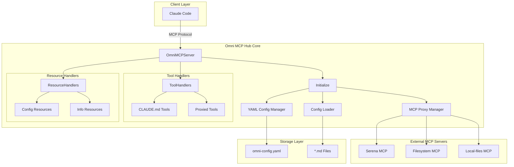
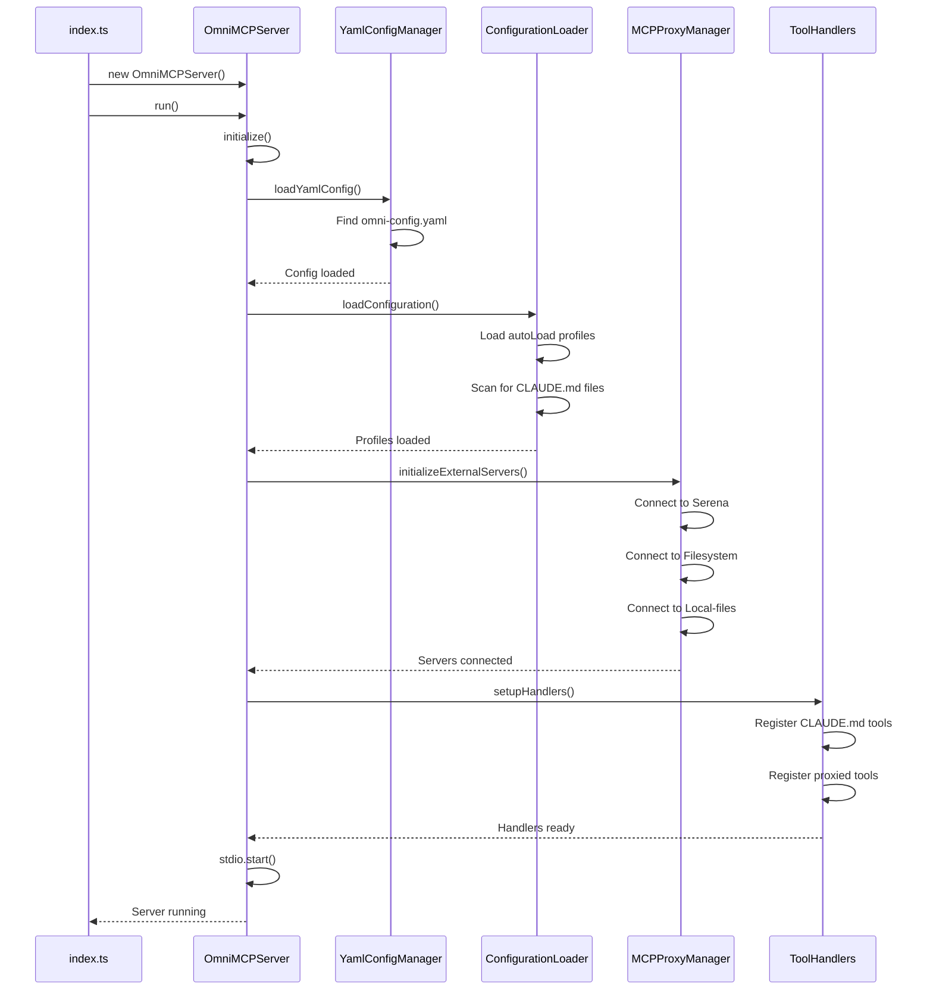
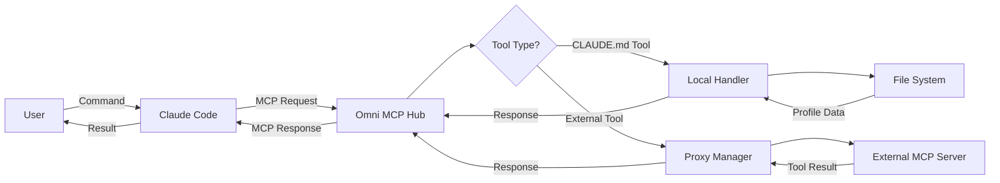
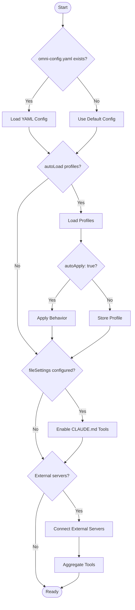
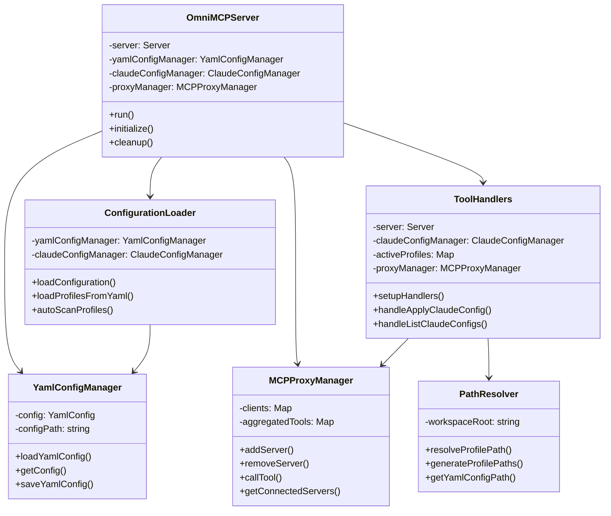
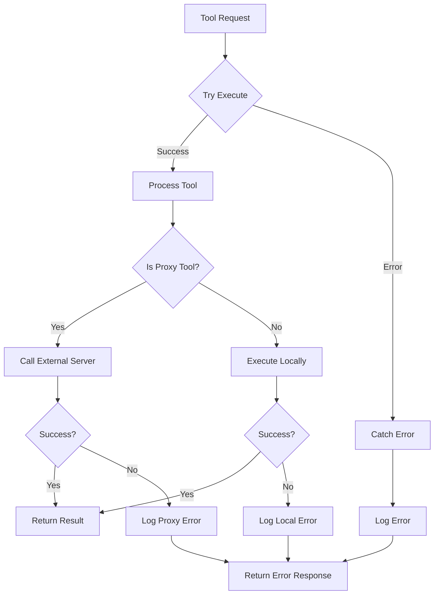
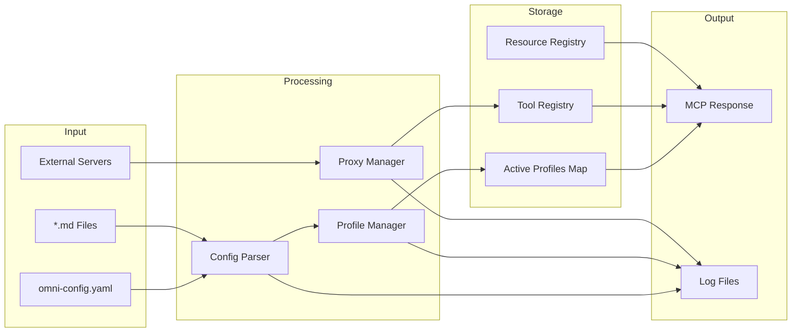

# Omni MCP Hub Architecture

## System Architecture Overview

## Initialization Flow

## Tool Request Flow

## Configuration Loading Flow

## Component Relationships

## Error Handling Flow

## Data Flow

